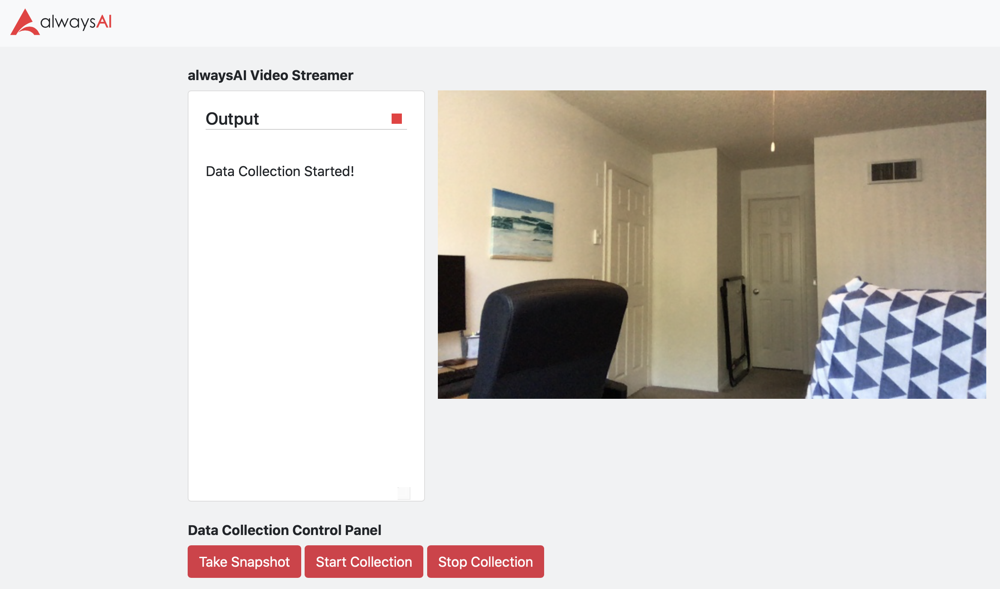
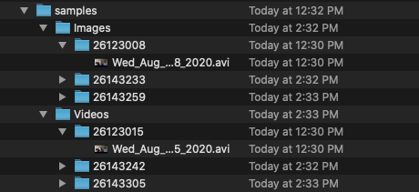

# Interactive Image Capture App
This alwaysAI app builds off of the app found [here](https://github.com/alwaysai/video-streamer) to provide a cusomized data collection server that allows the user to take snap shots or record videos and store them for later use.



## Requirements
- [alwaysAI account](https://alwaysai.co/auth?register=true)
- [alwaysAI CLI tools](https://dashboard.alwaysai.co/docs/getting_started/development_computer_setup.html)

Clone this repo into a local directory. Then cd into the project folder and run `aai app configure` and make the following selections:
- When prompted to choose a project, use the down arrow and select `Create new project`, choosing any name you like.
- When prompted to create `alwaysai.project.json`, select `Yes`

The `app.py` and `alwaysai.app.json` files should be automatically detected and you should not need to create them.

You can find details on working with projects [here](https://alwaysai.co/docs/getting_started/working_with_projects.html).

## Running
This app can be built and run as any other alwaysAI application. For general information on running apps, please see https://alwaysai.co/blog/building-and-deploying-apps-on-alwaysai 


```
Successfully installed Click-7.0 Flask-1.1.1 Flask-SocketIO-4.2.1 Jinja2-2.11.1 MarkupSafe-1.1.1 Werkzeug-1.0.0 dnspython-1.16.0 eventlet-0.25.1 greenlet-0.4.15 itsdangerous-1.1.0 monotonic-1.5 python-engineio-3.11.2 python-socketio-4.4.0 six-1.14.0
[INFO] Starting server at http://localhost:5001
[INFO] Web client connected: ba1e360eb41c4e59bd421bb859711fbb
⚠ Application has no models
✔ Install python virtual environment
✔ Install python dependencies
[INFO] Web client disconnected: ba1e360eb41c4e59bd421bb859711fbb
[INFO] Web client connected: a230dd0af93f4c32b6970e0b43c6da1e
[INFO] Connecting to server http://localhost:5001...
[INFO] Successfully connected to server.
```

Open the link in a browser on your machine. Next, start the realtime data collection app.

### Using Image Capture App

Once the application has started, you can interact with the data collection app by pressing the three buttons on the 'data collection panel' on the browser.
- Press `Take Snapshot` to take a single image
- Press `Start Collection` to start recording a video
- Press `Stop Collection` to stop recording a video
- Press `View All Data` to see collected videos and images.

You can take as many snapshots and videos as you'd like.

Once you're on the `View All Data` page, you can select a video or image and on the following page you can download the file to your Downloads folder, or delete it from the working directory. This is especially useful for viewing media on a remote (edge) device. All media downloaded in this case will be to your development machine, to be used in annotation and training.

When you're done with data collection, you can press the **red square** in the upper righthand square of the text panel on the home page to close the data collection app. Then return to the console window where you started the flask server and press control-C to bring down Flask.

#### Example Output

Pressing the buttons on the browser window will result in console output (as well as updating the streamer text in the browser)

```
[INFO] Connecting to server http://localhost:5001...
[INFO] Successfully connected to server.
snapshot signal received
Taking Snapshot
Snapshot Saved
start signal received
Data Collection Started!
stop signal received
Data Collection Ended
snapshot signal received
Taking Snapshot
Snapshot Saved
start signal received
Data Collection Started!
stop signal received
Data Collection Ended
elapsed time: 109.30
approx. FPS: 27.96
Program Ending
```
You will see files generated within `static/samples/` for each snapshot or video collection you take, as in the image below


